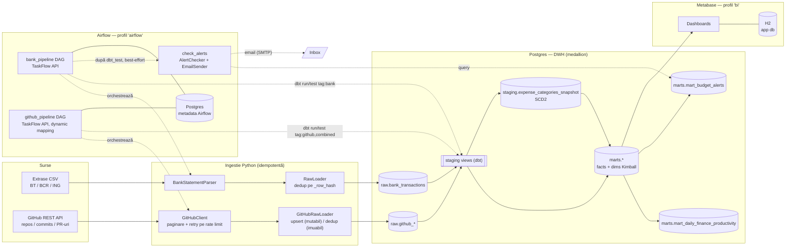
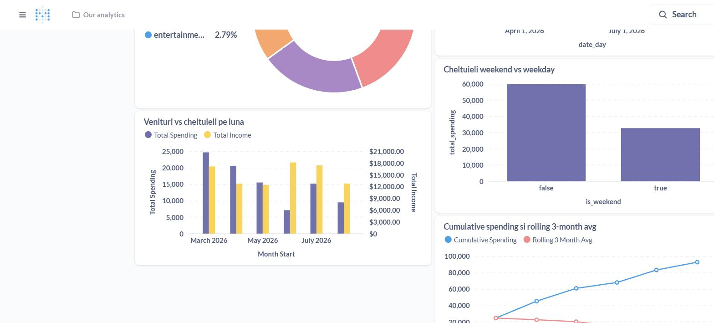

# DataForge

[](https://github.com/raducugabriel02/dataforge/actions/workflows/ci.yml)

Personal Data Platform & ELT Warehouse — ingest, transformare (medallion: Raw → Staging → Marts) și BI pentru date personale reale, orchestrat automat și rulabil integral local prin Docker Compose.

Detalii complete despre scop, arhitectură, stack și plan pe faze: vezi [CLAUDE.md](CLAUDE.md).

## Status

**Faza 0-4 (v1, sursa bancară) și Faza 5 (v2, sursa GitHub)** sunt complete, verificate live cu date reale. Peste plan, cu accent pe utilitate reală (nu doar narativ de portofoliu): dashboard Metabase extins (venituri/cashflow, sold pe bancă, weekend vs weekday) și **alerte financiare pe email** (buget pe categorie, sold sub prag, tranzacție mare) — vezi [Design Decisions](#design-decisions).

**CI (GitHub Actions)** adăugat — `ruff`/`mypy` la fiecare push/PR, plus `pytest`/`dbt build` complet rulate împotriva unui Postgres de test izolat (nu Postgres-ul de dezvoltare din `docker-compose.yml`). Vezi [Design Decisions](#design-decisions).

**Faza 6 (v3, Strava/Google Fit)** neîncepută — deprioritizată deliberat față de îmbunătățiri cu valoare reală imediată (sursa de fitness n-ar aduce nimic, autorul nu folosește Strava/Google Fit).

**Hardening dbt** adăugat: teste unitare pe logica de tie-break merchant și pe join-ul point-in-time SCD2 (regresii directe pentru bug-urile găsite pe date reale), **model contracts** (`contract: enforced`) pe cele 4 marts financiare, și **exposures** care leagă dashboard-ul Metabase și modulul de alerte email în lineage-ul `dbt docs`. Teste unitare complete și pentru `ingestion/github/`/`ingestion/alerts/` (înainte doar verificate live). Vezi [Design Decisions](#design-decisions).

**Sănătate financiară** adăugat: `mart_account_balances` (periodic snapshot fact, sold de sfârșit de lună per bancă, forward-fill pe lunile fără tranzacții) și `mart_financial_health` (savings rate, net worth + trend pe 3 luni, forecast de cheltuieli via regresie liniară în SQL pur), expuse într-un dashboard Metabase nou ("Sănătate Financiară"). Vezi [Design Decisions](#design-decisions).

## Arhitectură



Trei Postgres logic separate, fiecare cu un motiv concret (nu izolare "din reflex" — detalii în [Design Decisions](#design-decisions)): DWH-ul de mai sus, metadata Airflow (scheduler + webserver scriu concurent), și app DB-ul Metabase (H2 embedded, nu Postgres — un singur proces, fără concurrency reală).

## Quickstart

```bash
cp .env.example .env
# dacă ai deja alt Postgres pe portul 5432 (local sau alt proiect Docker),
# schimbă POSTGRES_PORT din .env înainte de a porni containerul
docker compose up -d

python -m venv .venv && source .venv/bin/activate   # sau .venv\Scripts\activate pe Windows
pip install -e ".[dev]"

python -m scripts.generate_fake_bank_data --bank all --months 6

# rulează testele cu variabilele din .env încărcate în mediu
set -a && . ./.env && set +a
pytest -v
ruff check . && mypy .

# ingest efectiv al unui extras (idempotent — poți rula de mai multe ori)
python -m ingestion --bank bt data/sample/bt_statement.csv
python -m ingestion --bank bcr data/sample/bcr_statement.csv
python -m ingestion --bank ing data/sample/ing_statement.csv

# BT24 nu oferă mereu export CSV/Excel, doar PDF — convertorul reconstruiește
# soldul per-tranzacție (validat contra soldului zilnic raportat de bancă) și
# scrie un CSV în formatul exact așteptat de BTParser, apoi ingest-ul normal
pip install -e ".[pdf]"
python -m scripts.convert_bt_pdf_statement data/private/extras_bt.pdf data/private/extras_bt.csv
python -m ingestion --bank bt data/private/extras_bt.csv

# instalează dbt (grup separat de dependențe, ține pinurile departe de restul proiectului)
pip install -e ".[dbt]"

# transformare: seed -> snapshot (SCD2) -> run -> test, sau toate deodată cu build
dbt deps --project-dir dbt_project --profiles-dir dbt_project
dbt build --project-dir dbt_project --profiles-dir dbt_project

# lineage + documentație interactivă
dbt docs generate --project-dir dbt_project --profiles-dir dbt_project
dbt docs serve --project-dir dbt_project --profiles-dir dbt_project

# sursa GitHub (Faza 5, v2) — completează GITHUB_TOKEN (fine-grained PAT, read-only
# pe Contents/Metadata/Pull requests) și GITHUB_USERNAME în .env, apoi:
python -m ingestion.github
dbt build --project-dir dbt_project --profiles-dir dbt_project --select tag:github tag:combined
```

> Pe Windows cu Python 3.14, executabilele `dbt.exe`/`pip.exe` pot crăpa silențios (issue de mediu, nu de proiect) — folosește `python -m pip ...` și, pentru dbt, `python -c "from dbt.cli.main import cli; cli()" <comandă>` în loc de `dbt <comandă>` direct.

> Comenzile `make` din `Makefile` (`make up`, `make test`, etc.) fac exact pașii de mai sus. Necesită GNU Make instalat — nu vine implicit pe Windows.

### Airflow (Faza 3 + 5)

Rulează într-un **profil Docker separat** (`airflow`), nepornit de `make up` — Airflow consumă ~4GB RAM, deci rămâne opțional cât lucrezi pe dbt/ingestie:

```bash
# completează AIRFLOW_FERNET_KEY în .env (vezi comentariul din .env.example)
make airflow-up
# asteapta pana serviciile sunt "healthy"
make airflow-logs
```

UI la http://localhost:8080 (user/parolă din `AIRFLOW_ADMIN_USER`/`AIRFLOW_ADMIN_PASSWORD`, implicit `admin`/`admin`). Două DAG-uri, zilnice, fiecare cu propria alertă Discord la eșec (`dags/common.py`, folosit de amândouă):

- **`bank_pipeline`** — verifică `data/private/` (fallback `data/sample/`) pentru CSV-uri noi, le ingerează idempotent, apoi `dbt seed → snapshot → run → test` (tag `bank`), apoi `check_alerts` — rulează `AlertChecker` (buget depășit pe categorie, sold sub prag, tranzacție neobișnuit de mare) și trimite un email consolidat dacă ceva s-a declanșat.
- **`github_pipeline`** (Faza 5) — ingerează repos, apoi (dynamic task mapping, un task per repo) commit-uri + PR-uri, apoi `dbt run/test` pe `tag:github` + `tag:combined` (reconstruiește și mart-ul combinat finanțe×productivitate). Cere `GITHUB_TOKEN`/`GITHUB_USERNAME` completate în `.env` — altfel task-ul de ingest eșuează cu un mesaj clar, nu silențios.

Un test dbt picat oprește pipeline-ul respectiv. `check_alerts` e diferit: e best-effort — completează `SMTP_USER`/`SMTP_PASSWORD`/`ALERT_EMAIL_TO` în `.env` (Gmail cere un [App Password](https://myaccount.google.com/apppasswords), nu parola de cont) ca să chiar primești email; necompletat, task-ul tot rulează și reușește, doar sare peste trimitere (vezi [Design Decisions](#design-decisions)).

```bash
make airflow-down   # oprește doar serviciile Airflow, Postgres-ul de date rămâne pornit separat
```

### Metabase (Faza 4)

La fel, profil Docker separat (`bi`), opt-in:

```bash
make bi-up
```

UI la http://localhost:3000 — primul start cere setup: creezi contul de admin local (nume/email/parolă — rămân doar în fișierul H2 din containerul tău, nu pleacă nicăieri) și conexiunea la Postgres:

| Câmp | Valoare |
|---|---|
| Host | `postgres` (numele serviciului din docker-compose, nu `localhost`) |
| Port | `5432` |
| Database name | `POSTGRES_DB` din `.env` |
| Username / Password | `POSTGRES_USER` / `POSTGRES_PASSWORD` din `.env` |
| Use a secure connection (SSL) | **nebifat** — Postgres-ul local rulează fără SSL configurat |

Dashboard-ul `Cheltuieli — Overview` (cheltuieli pe categorii, trend lunar cu medie mobilă 3 luni, top merchants, venituri vs cheltuieli pe lună, cumulative spending, sold în timp pe bancă, cheltuieli weekend vs weekday) e construit direct în UI din `marts.*`, nu versionat în git — Metabase își ține definițiile în propriul app DB (H2), nu în fișiere. Chart-urile de venituri/cashflow folosesc coloanele `total_income`/`net_cashflow` adăugate în `mart_monthly_spending`; cele de sold și weekend-vs-weekday sunt native SQL questions direct peste `marts.fact_financial_transactions`/`marts.dim_date`, fiindcă sunt vizualizări unice, fără nevoie de un model dbt reutilizabil.

```bash
make bi-down
```

## Demo

| dbt lineage graph | Dashboard Metabase |
|---|---|
|  |  |



## Structură

```
.github/workflows/      # CI (GitHub Actions): ruff/mypy + pytest/dbt build pe Postgres de test
infra/postgres/init/    # schema SQL rulat automat la primul start al containerului
scripts/                # utilitare: generatorul de date bancare fake, convertorul extras BT PDF->CSV
ingestion/              # module Python de ingestie (bank: Faza 1, github: Faza 5)
dbt_project/            # staging + marts + seeds + snapshots (bank: Faza 2, github: Faza 5)
dags/                   # DAG-uri Airflow (bank_pipeline: Faza 3, github_pipeline: Faza 5, common.py partajat)
tests/                  # unit tests
docs/interview-notes.md # note de arhitectură construite fază cu fază
docs/screenshots/       # capturi pentru README (lineage dbt, dashboard Metabase)
```

## Date

Repo-ul public conține **doar date sintetice**. Datele financiare reale stau local, în `data/private/` (gitignored) — niciodată în git.

Extrasul real BT vine ca PDF, nu CSV — `scripts/convert_bt_pdf_statement.py` îl convertește local (vezi Quickstart), fișierele rezultate rămân tot în `data/private/`.

## Design Decisions

Versiune scurtă a deciziilor de arhitectură; explicațiile complete, construite fază cu fază, sunt în [docs/interview-notes.md](docs/interview-notes.md).

- **Scheme separate (`raw`/`staging`/`marts`) într-un singur Postgres, nu baze de date separate** — medallion e o convenție de organizare a datelor, nu un motiv de izolare la nivel de proces; un singur Postgres ține costul (RAM, conexiuni de gestionat) minim cât timp nu există concurrency reală între straturi.
- **Postgres separat pentru metadata Airflow** — scheduler-ul și webserver-ul scriu/citesc concurent, non-stop, în metadata (DAG runs, task instances); amestecat cu DWH-ul ar fi cuplat două cicluri de viață diferite (`make clean` pe unul nu trebuie să-l afecteze pe celălalt).
- **H2 embedded pentru app DB-ul Metabase, nu Postgres** — un singur proces, un singur user local, scrieri doar manuale (salvezi un dashboard) — nicio concurrency reală de rezolvat. Diferă de cazul Airflow de mai sus exact prin lipsa acestei concurențe; regula e "izolezi când există un motiv concret", nu izolare din reflex.
- **Idempotență la fiecare strat, nu doar la ingest** — dedup pe `_row_hash` în `raw`, `dbt seed`/`snapshot`/`run` toate sigure la re-rulare (detalii: [Idempotența end-to-end](docs/interview-notes.md#idempotența-end-to-end-după-faza-3)) — un DAG zilnic *va* rula de mai multe ori peste aceleași date (retry, restart), și fiecare pas trebuie să reziste la asta independent.
- **SCD Type 2 via `dbt snapshot`, nu `updated_at` simplu pe categorii** — categoriile de cheltuieli se schimbă în timp; păstrăm istoricul (`valid_from`/`valid_to`/`is_current`) ca un raport din trecut să folosească categoria validă *atunci*, nu cea curentă.
- **Airflow și Metabase în profiluri Docker opt-in (`airflow`, `bi`), nu în `make up`** — Airflow consumă ~4GB RAM; separarea permite să lucrezi pe ingestie/dbt fără costul lor, pornindu-le explicit doar când ai nevoie.
- **Idempotența la sursa GitHub aleasă per entitate, nu copiată din bank** — `raw.github_commits` e append-only cu dedup pe `(repo_full_name, sha)` ca `raw.bank_transactions`, dar `raw.github_repositories`/`raw.github_pull_requests` fac **upsert**: sunt entități mutabile (starea unui PR, `pushed_at`-ul unui repo), deci raw ține doar ultima stare cunoscută, nu un istoric. Detalii: [Extensibilitatea arhitecturii](docs/interview-notes.md#extensibilitatea-arhitecturii-pe-o-a-doua-sursă-după-faza-5).
- **`fact_daily_productivity` e sparse (doar zile cu activitate), `mart_daily_finance_productivity` e dense (fiecare zi din intervalul activ)** — un fapt Kimball ține doar evenimente reale; un mart pentru corelații are nevoie de zerouri explicite, altfel o zi fără commit-uri ar lipsi din analiză în loc să fie un punct de date real.
- **Alertele pe email sunt best-effort, nu o precondiție a pipeline-ului** — la fel ca alerta Discord de eșec (`dags/common.py`), `check_alerts` prinde orice excepție la trimiterea emailului și doar o loghează; task-ul reușește chiar dacă SMTP-ul e nesetat sau serverul de mail e jos. Diferă totuși de eșecul unui test dbt: un test dbt picat înseamnă *date suspecte*, deci pipeline-ul trebuie să se oprească; o alertă netrimisă înseamnă doar *n-am reușit să te anunț*, datele rămân corecte — nu-i același nivel de gravitate, deci nu tratăm eșecul la fel.
- **`mart_budget_alerts` e un mart separat, nu extinde `mart_monthly_spending`** — grain-ul diferă (doar categoriile cu buget definit, via inner join pe seed-ul `category_budgets`) și scopul e altul (verificare operațională, nu raportare generală); un mart de agregare Kimball nu trebuie să devină locul unde bag orice query are nevoie de el.
- **CI rulează pe un Postgres de test efemer (service container), nu pe Postgres-ul din `docker-compose.yml`** — job-ul de `test` pornește un `postgres:16` gol, îl inițializează cu aceleași SQL-uri din `infra/postgres/init/`, generează date sintetice, le ingerează și rulează `pytest`+`dbt build` complet peste el; containerul dispare la finalul job-ului. Așa CI verifică repo-ul așa cum ar arăta la un `git clone` proaspăt, nu peste starea locală acumulată a autorului. Service container-ele din Actions pornesc *înainte* de `actions/checkout`, deci nu poți monta `infra/postgres/init/` ca `/docker-entrypoint-initdb.d` (fișierele repo-ului încă nu există pe disc la acel moment) — scripturile SQL sunt rulate explicit, ca pas separat, după checkout.
- **dbt unit tests pe logica din SQL, nu doar `data tests` pe rezultatul final** — un `data test` verifică datele *după* ce modelul a rulat peste tabele reale; un `unit test` dă rânduri fixe modelului și verifică output-ul exact, fără nicio dependență de starea curentă a warehouse-ului. Le-am scris punctual pe cele două bug-uri reale găsite la încărcarea datelor (fan-out la merchant, join SCD2 greșit) — regresie garantată dacă cineva scoate din greșeală `row_number()`/tie-break-ul din model, verificat live inversând temporar fix-ul și confirmând că testul pică.
- **Model contracts (`contract: enforced: true`) pe cele 4 marts financiare** — `dbt build` compară tipurile de coloană declarate în `schema.yml` cu ce produce efectiv SQL-ul modelului și **blochează build-ul** la orice discrepanță de nume/tip/număr de coloane, înainte ca tabela să fie scrisă. Pus punctual pe `mart_budget_alerts` (singurul mart citit prin SQL brut din `ingestion/alerts/checker.py`, nu doar din alte modele dbt — o redenumire acolo n-ar fi prinsă de niciun test dbt normal) și pe `mart_monthly_spending` (consumat direct de Metabase, care nu rulează teste dbt). Efect secundar util: dbt a avertizat că mai multe coloane `numeric` fără precizie explicită riscau rotunjire silențioasă — rezolvat cu `cast(... as numeric(14,2))` în modele.
- **Exposures** — `metabase_cheltuieli_overview` și `email_budget_alerts` declară în dbt cine consumă efectiv fiecare mart (dashboard-ul Metabase, respectiv modulul de alerte email), ca să apară în lineage-ul `dbt docs generate` — altfel graful se termină la ultimul mart și nu arată ce se întâmplă cu el în afara dbt.
- **`mart_account_balances` e un periodic snapshot fact, nu un transaction fact** — `fact_financial_transactions` ține un rând per eveniment (o tranzacție); aici avem nevoie de un rând per stare repetată la interval fix (soldul de sfârșit de lună, per bancă), pentru că "cât am în total" e o întrebare despre o stare, nu despre un eveniment. Grain-ul e dens (fiecare bancă apare în fiecare lună dintre prima și ultima ei tranzacție), cu forward-fill via gaps-and-islands (`count()` peste NULL-uri + `first_value()` pe grup) în lunile fără nicio mișcare — altfel soldul acelei bănci ar "dispărea" temporar din net worth, deși banii încă există în cont. Postgres nu are `IGNORE NULLS` pe window functions; gaps-and-islands e echivalentul standard-SQL.
- **Forecast de cheltuieli via `regr_slope`/`regr_intercept`, nu Python/ML** — sunt funcții agregat standard Postgres, utilizabile ca window functions cu `OVER`, care calculează o regresie liniară simplă (metoda celor mai mici pătrate) direct în SQL. Cu sub 2 luni distincte de date, Postgres le întoarce `NULL` automat — limitarea forecast-ului cu istoric insuficient e vizibilă direct în date, nu ascunsă sau aproximată.
