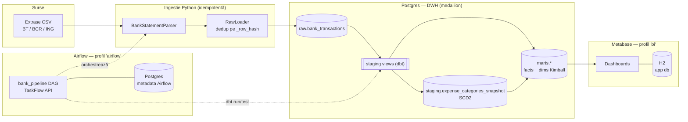
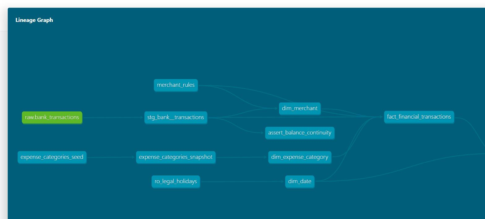
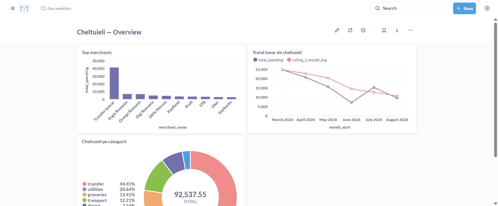

# DataForge

Personal Data Platform & ELT Warehouse — ingest, transformare (medallion: Raw → Staging → Marts) și BI pentru date personale reale, orchestrat automat și rulabil integral local prin Docker Compose.

Detalii complete despre scop, arhitectură, stack și plan pe faze: vezi [CLAUDE.md](CLAUDE.md).

## Status

**Faza 4 — Metabase + polish v1.** Postgres + ingestie idempotentă (Faza 1) + proiect dbt complet (Faza 2) + orchestrare Airflow (Faza 3) + dashboard Metabase peste `marts.*` (cheltuieli pe categorii, trend lunar, top merchants). v1 (sursa bancară) e completă.

## Arhitectură



Trei Postgres logic separate, fiecare cu un motiv concret (nu izolare "din reflex" — detalii în [Design Decisions](#design-decisions)): DWH-ul de mai sus, metadata Airflow (scheduler + webserver scriu concurent), și app DB-ul Metabase (H2 embedded, nu Postgres — un singur proces, fără concurrency reală).

## Quickstart

```bash
cp .env.example .env
# dacă ai deja alt Postgres pe portul 5432 (local sau alt proiect Docker),
# schimbă POSTGRES_PORT din .env înainte de a porni containerul
docker compose up -d

python -m venv .venv && source .venv/bin/activate   # sau .venv\Scripts\activate pe Windows
pip install -e ".[dev]"

python -m scripts.generate_fake_bank_data --bank all --months 6

# rulează testele cu variabilele din .env încărcate în mediu
set -a && . ./.env && set +a
pytest -v
ruff check . && mypy .

# ingest efectiv al unui extras (idempotent — poți rula de mai multe ori)
python -m ingestion --bank bt data/sample/bt_statement.csv
python -m ingestion --bank bcr data/sample/bcr_statement.csv
python -m ingestion --bank ing data/sample/ing_statement.csv

# instalează dbt (grup separat de dependențe, ține pinurile departe de restul proiectului)
pip install -e ".[dbt]"

# transformare: seed -> snapshot (SCD2) -> run -> test, sau toate deodată cu build
dbt deps --project-dir dbt_project --profiles-dir dbt_project
dbt build --project-dir dbt_project --profiles-dir dbt_project

# lineage + documentație interactivă
dbt docs generate --project-dir dbt_project --profiles-dir dbt_project
dbt docs serve --project-dir dbt_project --profiles-dir dbt_project
```

> Comenzile `make` din `Makefile` (`make up`, `make test`, etc.) fac exact pașii de mai sus. Necesită GNU Make instalat — nu vine implicit pe Windows.

### Airflow (Faza 3)

Rulează într-un **profil Docker separat** (`airflow`), nepornit de `make up` — Airflow consumă ~4GB RAM, deci rămâne opțional cât lucrezi pe dbt/ingestie:

```bash
# completează AIRFLOW_FERNET_KEY în .env (vezi comentariul din .env.example)
make airflow-up
# asteapta pana serviciile sunt "healthy"
make airflow-logs
```

UI la http://localhost:8080 (user/parolă din `AIRFLOW_ADMIN_USER`/`AIRFLOW_ADMIN_PASSWORD`, implicit `admin`/`admin`). DAG-ul `bank_pipeline` rulează zilnic: verifică `data/private/` (fallback `data/sample/`) pentru CSV-uri noi, le ingerează idempotent, apoi `dbt seed → snapshot → run → test` (filtrate pe tag `bank`). Un test picat oprește pipeline-ul și — dacă `DISCORD_WEBHOOK_URL` e setat în `.env` — trimite o alertă pe Discord.

```bash
make airflow-down   # oprește doar serviciile Airflow, Postgres-ul de date rămâne pornit separat
```

### Metabase (Faza 4)

La fel, profil Docker separat (`bi`), opt-in:

```bash
make bi-up
```

UI la http://localhost:3000 — primul start cere setup: creezi contul de admin local (nume/email/parolă — rămân doar în fișierul H2 din containerul tău, nu pleacă nicăieri) și conexiunea la Postgres:

| Câmp | Valoare |
|---|---|
| Host | `postgres` (numele serviciului din docker-compose, nu `localhost`) |
| Port | `5432` |
| Database name | `POSTGRES_DB` din `.env` |
| Username / Password | `POSTGRES_USER` / `POSTGRES_PASSWORD` din `.env` |
| Use a secure connection (SSL) | **nebifat** — Postgres-ul local rulează fără SSL configurat |

Dashboard-ul `Cheltuieli — Overview` (cheltuieli pe categorii, trend lunar cu medie mobilă 3 luni, top merchants) e construit direct în UI din `marts.*`, nu versionat în git — Metabase își ține definițiile în propriul app DB (H2), nu în fișiere.

```bash
make bi-down
```

## Demo

| dbt lineage graph | Dashboard Metabase |
|---|---|
|  |  |

## Structură

```
infra/postgres/init/   # schema SQL rulat automat la primul start al containerului
scripts/                # utilitare, ex: generatorul de date bancare fake
ingestion/              # module Python de ingestie (Faza 1+)
dbt_project/            # staging + marts + seeds + snapshots (Faza 2)
dags/                   # DAG-uri Airflow (Faza 3+)
tests/                  # unit tests
docs/interview-notes.md # note de arhitectură construite fază cu fază
docs/screenshots/       # capturi pentru README (lineage dbt, dashboard Metabase)
```

## Date

Repo-ul public conține **doar date sintetice**. Datele financiare reale stau local, în `data/private/` (gitignored) — niciodată în git.

## Design Decisions

Versiune scurtă a deciziilor de arhitectură; explicațiile complete, construite fază cu fază, sunt în [docs/interview-notes.md](docs/interview-notes.md).

- **Scheme separate (`raw`/`staging`/`marts`) într-un singur Postgres, nu baze de date separate** — medallion e o convenție de organizare a datelor, nu un motiv de izolare la nivel de proces; un singur Postgres ține costul (RAM, conexiuni de gestionat) minim cât timp nu există concurrency reală între straturi.
- **Postgres separat pentru metadata Airflow** — scheduler-ul și webserver-ul scriu/citesc concurent, non-stop, în metadata (DAG runs, task instances); amestecat cu DWH-ul ar fi cuplat două cicluri de viață diferite (`make clean` pe unul nu trebuie să-l afecteze pe celălalt).
- **H2 embedded pentru app DB-ul Metabase, nu Postgres** — un singur proces, un singur user local, scrieri doar manuale (salvezi un dashboard) — nicio concurrency reală de rezolvat. Diferă de cazul Airflow de mai sus exact prin lipsa acestei concurențe; regula e "izolezi când există un motiv concret", nu izolare din reflex.
- **Idempotență la fiecare strat, nu doar la ingest** — dedup pe `_row_hash` în `raw`, `dbt seed`/`snapshot`/`run` toate sigure la re-rulare (detalii: [Idempotența end-to-end](docs/interview-notes.md#idempotența-end-to-end-după-faza-3)) — un DAG zilnic *va* rula de mai multe ori peste aceleași date (retry, restart), și fiecare pas trebuie să reziste la asta independent.
- **SCD Type 2 via `dbt snapshot`, nu `updated_at` simplu pe categorii** — categoriile de cheltuieli se schimbă în timp; păstrăm istoricul (`valid_from`/`valid_to`/`is_current`) ca un raport din trecut să folosească categoria validă *atunci*, nu cea curentă.
- **Airflow și Metabase în profiluri Docker opt-in (`airflow`, `bi`), nu în `make up`** — Airflow consumă ~4GB RAM; separarea permite să lucrezi pe ingestie/dbt fără costul lor, pornindu-le explicit doar când ai nevoie.
