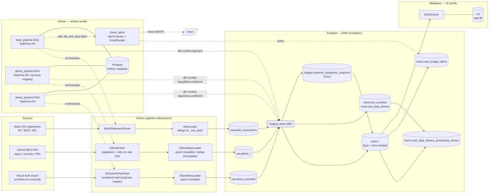
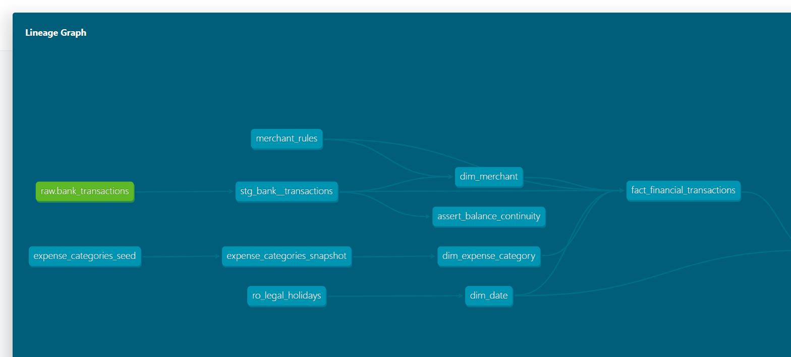
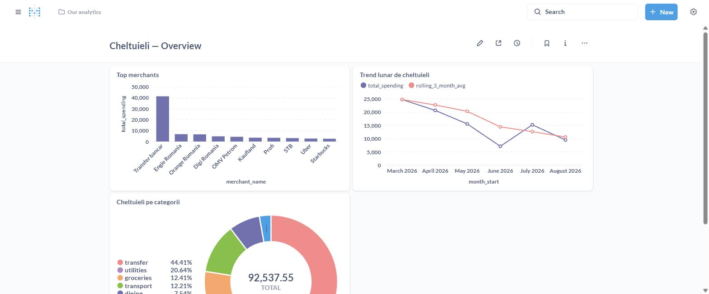
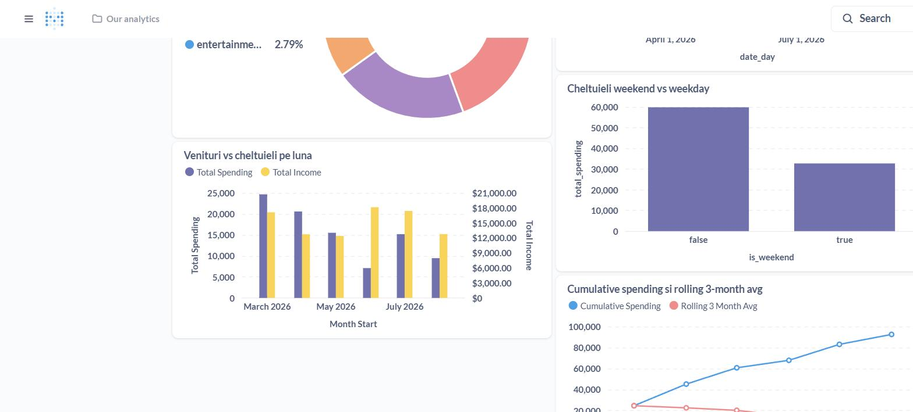

# DataForge

[](https://github.com/raducugabriel02/dataforge/actions/workflows/ci.yml)
[](https://raducugabriel02.github.io/dataforge/)

Personal Data Platform & ELT Warehouse — ingestion, transformation (medallion: Raw → Staging → Marts), and BI for real personal data, fully automated and runnable locally via Docker Compose.

## Status

**Phases 0-4 (v1, bank source) and Phase 5 (v2, GitHub source)** are complete, verified live with real data. Beyond the original plan, with a focus on genuine usefulness (not just portfolio narrative): an expanded Metabase dashboard (income/cashflow, balance per bank, weekend vs. weekday) and **financial alerts via email** (category budget, balance below threshold, large transaction) — see [Design Decisions](#design-decisions).

**CI (GitHub Actions)** added — `ruff`/`mypy` on every push/PR, plus a full `pytest`/`dbt build` run against an isolated test Postgres (not the development Postgres from `docker-compose.yml`). See [Design Decisions](#design-decisions).

**Phase 6 (v3, Strava)** — complete: ingestion + dbt + Airflow orchestration, verified live with the first real export (3 activities, Huawei watch synced with Strava). The real export uncovered two latent bugs that were undiscoverable without real data: the generic `Distance` column is in **kilometers**, not meters as originally assumed, and `Moving Time` is formatted as a float (`"66.0"`) unlike `Elapsed Time` from the same row (`"66"`). `raw.strava_activities` (upsert, mutable entity), `fact_activities` (atomic grain, like `fact_financial_transactions`), and `fact_daily_fitness` (daily aggregate) feed into `mart_daily_finance_productivity_fitness`, renamed from the finance×productivity-only variant. `strava_pipeline` (the third DAG) verified live through the full red→green cycle (a dbt test intentionally broken → alert → fixed). See [Design Decisions](#design-decisions).

**dbt hardening** added: unit tests on the merchant tie-break logic and on the point-in-time SCD2 join (direct regressions for the bugs found on real data), **model contracts** (`contract: enforced`) on the 4 financial marts, and **exposures** linking the Metabase dashboard and the email alerts module into the `dbt docs` lineage. Full unit tests also added for `ingestion/github/`/`ingestion/alerts/` (previously only verified live). See [Design Decisions](#design-decisions).

**Financial health** added: `mart_account_balances` (periodic snapshot fact, end-of-month balance per bank, forward-filled for months with no transactions) and `mart_financial_health` (savings rate, net worth + 3-month trend, spending forecast via linear regression in pure SQL), exposed in a new Metabase dashboard ("Financial Health"). See [Design Decisions](#design-decisions).

**`fact_financial_transactions` is now incremental** (`unique_key: transaction_id`), closing a real gap against the project's own idempotency rule — the rest of the marts stay `table`, deliberately, not out of inertia. See [Design Decisions](#design-decisions).

**dbt Semantic Layer (MetricFlow)** added — a single definition for `total_spending`/`total_income`/`savings_rate` (over `fact_financial_transactions`, same formula as `mart_financial_health`), queryable generatively over any combination of dimensions (category, merchant, bank, month, weekend/weekday) without new SQL per combination. Runs fully locally (`dbt-metricflow`, no dbt Cloud). Verified live: the `savings_rate` from the query matches exactly the value already materialized in `mart_financial_health`. See [Design Decisions](#design-decisions).

**`dbt docs` published live on GitHub Pages**: [raducugabriel02.github.io/dataforge](https://raducugabriel02.github.io/dataforge/) — the full lineage (sources, exposures, metrics, semantic models), regenerated automatically on every push to `master` (`.github/workflows/docs.yml`), built from real relationships in CI, not just a static graph. The repo is public (previously verified: zero real data in history, only synthetic data). See [Design Decisions](#design-decisions).

**Postgres indexing on `fact_financial_transactions`** (`transaction_id` unique, `date_key`/`merchant_key`/`category_key`/`txn_date`) — verified with `EXPLAIN ANALYZE`, not just added: at current volume (32 rows) Postgres correctly chooses a Seq Scan (an index wouldn't help on a one-page table), but at a simulated volume (~5,400 synthetic rows, deleted after the test) the planner switches to a Bitmap Index Scan on `category_key` — live evidence, not assumption. Deliberately no index on `source_bank` (only 3 distinct values, too low cardinality). See [Design Decisions](#design-decisions).

**Idempotency tests for `GitHubRawLoader`/`StravaRawLoader` and unit tests for `dags/common.py`** — both previously only verified live in earlier sessions, never caught by an automated regression. Now covered: upsert on a mutable entity (repo/PR/activity — including verifying that a changed field actually reflects on re-load, not just that it doesn't duplicate), append-only dedup on commits, and `notify_discord_failure`/`dbt_command` (pure stdlib, testable without Airflow installed locally). 70 tests, all green.

## Architecture


```mermaid
flowchart LR
    subgraph src["Sources"]
        csv["Bank CSV statements<br/>BT / BCR / ING"]
        gh["GitHub REST API<br/>repos / commits / PRs"]
        strava["Strava bulk export<br/>activities.csv (manual)"]
    end

    subgraph ingest["Python ingestion (idempotent)"]
        parser["BankStatementParser"]
        loader["RawLoader<br/>dedup on _row_hash"]
        ghclient["GitHubClient<br/>pagination + retry on rate limit"]
        ghloader["GitHubRawLoader<br/>upsert (mutable) / dedup (immutable)"]
        stravaparser["StravaActivityParser<br/>positional read (duplicate header)"]
        stravaloader["StravaRawLoader<br/>upsert (mutable)"]
    end

    subgraph dwh["Postgres — DWH (medallion)"]
        raw[("raw.bank_transactions")]
        ghraw[("raw.github_*")]
        stravaraw[("raw.strava_activities")]
        staging[["staging views (dbt)"]]
        snapshot[("staging.expense_categories_snapshot<br/>SCD2")]
        marts[("marts.*<br/>facts + dims Kimball")]
        fitnessmart[("marts.fact_activities<br/>marts.fact_daily_fitness")]
        combined[("marts.mart_daily_finance_productivity_fitness")]
        budgetmart[("marts.mart_budget_alerts")]
    end

    subgraph orch["Airflow — 'airflow' profile"]
        dag["bank_pipeline DAG<br/>TaskFlow API"]
        ghdag["github_pipeline DAG<br/>TaskFlow API, dynamic mapping"]
        stravadag["strava_pipeline DAG<br/>TaskFlow API"]
        alertcheck["check_alerts<br/>AlertChecker + EmailSender"]
        afdb[("Postgres<br/>Airflow metadata")]
    end

    subgraph bi["Metabase — 'bi' profile"]
        dash["Dashboards"]
        mbdb[("H2<br/>app db")]
    end

    csv --> parser --> loader --> raw
    gh --> ghclient --> ghloader --> ghraw
    strava --> stravaparser --> stravaloader --> stravaraw
    raw --> staging --> marts
    ghraw --> staging
    stravaraw --> staging --> fitnessmart
    staging --> snapshot --> marts
    marts --> combined
    fitnessmart --> combined
    marts --> budgetmart
    marts --> dash
    dag -. orchestrates .-> parser
    dag -. "dbt run/test tag:bank" .-> staging
    dag -. "after dbt_test, best-effort" .-> alertcheck
    alertcheck -. query .-> budgetmart
    alertcheck -. "email (SMTP)" .-> email[/"Inbox"/]
    ghdag -. orchestrates .-> ghclient
    ghdag -. "dbt run/test tag:github,combined" .-> staging
    stravadag -. orchestrates .-> stravaparser
    stravadag -. "dbt run/test tag:strava,combined" .-> staging
    dag --- afdb
    ghdag --- afdb
    stravadag --- afdb
    dash --- mbdb
```

Three logically separate Postgres instances, each for a concrete reason (not "reflex" isolation — details in [Design Decisions](#design-decisions)): the DWH above, Airflow metadata (scheduler + webserver write concurrently), and the Metabase app DB (embedded H2, not Postgres — a single process, no real concurrency).

## Quickstart

```bash
cp .env.example .env
# if you already have another Postgres on port 5432 (local or another Docker
# project), change POSTGRES_PORT in .env before starting the container
docker compose up -d

python -m venv .venv && source .venv/bin/activate   # or .venv\Scripts\activate on Windows
pip install -e ".[dev]"

python -m scripts.generate_fake_bank_data --bank all --months 6

# run the tests with the variables from .env loaded into the environment
set -a && . ./.env && set +a
pytest -v
ruff check . && mypy .

# actual ingestion of a statement (idempotent — safe to run multiple times)
python -m ingestion --bank bt data/sample/bt_statement.csv
python -m ingestion --bank bcr data/sample/bcr_statement.csv
python -m ingestion --bank ing data/sample/ing_statement.csv

# BT24 doesn't always offer a CSV/Excel export, only PDF — the converter
# reconstructs the per-transaction balance (validated against the daily
# balance reported by the bank) and writes a CSV in the exact format
# expected by BTParser, then regular ingestion follows
pip install -e ".[pdf]"
python -m scripts.convert_bt_pdf_statement data/private/extras_bt.pdf data/private/extras_bt.csv
python -m ingestion --bank bt data/private/extras_bt.csv

# install dbt (separate dependency group, keeps pins away from the rest of the project)
pip install -e ".[dbt]"

# transformation: seed -> snapshot (SCD2) -> run -> test, or all at once with build
dbt deps --project-dir dbt_project --profiles-dir dbt_project
dbt build --project-dir dbt_project --profiles-dir dbt_project

# lineage + interactive documentation
dbt docs generate --project-dir dbt_project --profiles-dir dbt_project
dbt docs serve --project-dir dbt_project --profiles-dir dbt_project

# GitHub source (Phase 5, v2) — fill in GITHUB_TOKEN (fine-grained PAT,
# read-only on Contents/Metadata/Pull requests) and GITHUB_USERNAME in .env, then:
python -m ingestion.github
dbt build --project-dir dbt_project --profiles-dir dbt_project --select tag:github tag:combined

# Strava source (Phase 6, v3) — manual export (Strava limits to one per week):
# strava.com -> Settings -> My Account -> Download or Delete Your Account ->
# Download Request. Unzip into data/private/strava_export_raw/, then:
python -m ingestion.strava data/private/strava_export_raw/activities.csv
dbt build --project-dir dbt_project --profiles-dir dbt_project --select tag:strava tag:combined

# Semantic Layer (MetricFlow, local, no dbt Cloud) — generative querying of
# financial metrics (total_spending, total_income, savings_rate) over any
# combination of dimensions (category, merchant, bank, month, weekend/weekday),
# without new SQL. Requires dbt build to have run at least once (generates
# target/semantic_manifest.json).
pip install -e ".[semantic-layer]"
cd dbt_project
mf validate-configs
mf query --metrics total_spending,total_income,savings_rate --group-by metric_time__month,transaction__currency
mf query --metrics total_spending --group-by category__category_group
cd ..
```

> On Windows with Python 3.14, the `dbt.exe`/`pip.exe` executables can crash silently (an environment issue, not a project one) — use `python -m pip ...` and, for dbt, `python -c "from dbt.cli.main import cli; cli()" <command>` instead of calling `dbt <command>` directly.

> Also on Windows: `mf` (dbt-metricflow) can fail with `cannot use a string pattern on a bytes-like object` — the `halo` spinner writes Unicode characters to a `cp1252` console. Run with `PYTHONIOENCODING=utf-8` before `mf` (e.g. `PYTHONIOENCODING=utf-8 mf validate-configs`).

> The `make` commands in the `Makefile` (`make up`, `make test`, etc.) do exactly the steps above. Requires GNU Make installed — not available by default on Windows.

### Airflow (Phase 3 + 5 + 6)

Runs in a **separate Docker profile** (`airflow`), not started by `make up` — Airflow consumes ~4GB RAM, so it stays optional while working on dbt/ingestion:

```bash
# fill in AIRFLOW_FERNET_KEY in .env (see the comment in .env.example)
make airflow-up
# wait until the services are "healthy"
make airflow-logs
```

UI at http://localhost:8080 (user/password from `AIRFLOW_ADMIN_USER`/`AIRFLOW_ADMIN_PASSWORD`, default `admin`/`admin`). Three daily DAGs, each with its own Discord failure alert (`dags/common.py`, shared by all):

- **`bank_pipeline`** — checks `data/private/` (falls back to `data/sample/`) for new CSV files, ingests them idempotently, then `dbt seed → snapshot → run → test` (tag `bank`), then `check_alerts` — runs `AlertChecker` (budget exceeded per category, balance below threshold, unusually large transaction) and sends a consolidated email if anything triggered.
- **`github_pipeline`** (Phase 5) — ingests repos, then (dynamic task mapping, one task per repo) commits + PRs, then `dbt run/test` on `tag:github` + `tag:combined` (also rebuilds the combined finance×productivity×fitness mart). Requires `GITHUB_TOKEN`/`GITHUB_USERNAME` filled in `.env` — otherwise the ingest task fails with a clear message, not silently.
- **`strava_pipeline`** (Phase 6) — unlike `github_pipeline` (polls a live API), the source is a manual export: looks for `data/private/strava_export_raw/activities.csv`, ingests it idempotently (upsert on `activity_id`), then `dbt run/test` on `tag:strava` + `tag:combined`. With no new file, the `ingest` task still succeeds (explicitly returns "no Strava export to ingest"), and dbt runs on the already-existing data.

A failing dbt test stops the respective pipeline — verified live for `strava_pipeline` too (the `distance_meters` test intentionally broken → `dbt_test` goes red, `check_source`/`ingest`/`dbt_run` stay green, the Discord alert attempts to send and logs clearly if the webhook isn't set → fixed → green again, the exact cycle first verified in Phase 3 on `bank_pipeline`). `check_alerts` is different: it's best-effort — fill in `SMTP_USER`/`SMTP_PASSWORD`/`ALERT_EMAIL_TO` in `.env` (Gmail requires an [App Password](https://myaccount.google.com/apppasswords), not your account password) to actually receive email; left unfilled, the task still runs and succeeds, it just skips sending (see [Design Decisions](#design-decisions)).

```bash
make airflow-down   # stops only the Airflow services, the data Postgres keeps running separately
```

### Metabase (Phase 4)

Also a separate Docker profile (`bi`), opt-in:

```bash
make bi-up
```

UI at http://localhost:3000 — the first start requires setup: you create the local admin account (name/email/password — stays only in the H2 file inside your container, never leaves) and the Postgres connection:

| Field | Value |
|---|---|
| Host | `postgres` (the service name from docker-compose, not `localhost`) |
| Port | `5432` |
| Database name | `POSTGRES_DB` from `.env` |
| Username / Password | `POSTGRES_USER` / `POSTGRES_PASSWORD` from `.env` |
| Use a secure connection (SSL) | **unchecked** — the local Postgres runs without SSL configured |

The `Spending — Overview` dashboard (spending by category, monthly trend with 3-month moving average, top merchants, income vs. spending by month, cumulative spending, balance over time per bank, weekend vs. weekday spending) is built directly in the UI from `marts.*`, not version-controlled in git — Metabase keeps its definitions in its own app DB (H2), not in files. The income/cashflow charts use the `total_income`/`net_cashflow` columns added to `mart_monthly_spending`; the balance and weekend-vs-weekday charts are native SQL questions directly over `marts.fact_financial_transactions`/`marts.dim_date`, since they're one-off visualizations with no need for a reusable dbt model.

```bash
make bi-down
```

## Demo

| dbt lineage graph | Metabase dashboard |
|---|---|
|  |  |



## Structure

```
.github/workflows/      # CI (GitHub Actions): ruff/mypy + pytest/dbt build on a test Postgres
infra/postgres/init/    # schema SQL run automatically on the container's first start
scripts/                # utilities: fake bank data generator, BT PDF->CSV statement converter
ingestion/              # Python ingestion modules (bank: Phase 1, github: Phase 5, strava: Phase 6)
dbt_project/            # staging + marts + seeds + snapshots (bank: Phase 2, github: Phase 5, strava: Phase 6)
dags/                   # Airflow DAGs (bank_pipeline: Phase 3, github_pipeline: Phase 5, strava_pipeline: Phase 6, shared common.py)
tests/                  # unit tests
docs/design-decisions.md # architecture decisions, recorded as they were made
docs/screenshots/       # README screenshots (dbt lineage, Metabase dashboard)
```

## Data

The public repo contains **only synthetic data**. Real financial data stays local, in `data/private/` (gitignored) — never in git.

The real BT statement comes as a PDF, not CSV — `scripts/convert_bt_pdf_statement.py` converts it locally (see Quickstart); the resulting files stay in `data/private/` too.

## Design Decisions

Short version of the architecture decisions; the full write-ups, recorded as they were made, are in [docs/design-decisions.md](docs/design-decisions.md).

- **Separate schemas (`raw`/`staging`/`marts`) in a single Postgres, not separate databases** — medallion is a data organization convention, not a reason for process-level isolation; a single Postgres keeps cost (RAM, connections to manage) minimal as long as there's no real concurrency between layers.
- **Separate Postgres for Airflow metadata** — the scheduler and webserver read/write concurrently, non-stop, into metadata (DAG runs, task instances); mixed with the DWH it would couple two different lifecycles (`make clean` on one shouldn't affect the other).
- **Embedded H2 for the Metabase app DB, not Postgres** — a single process, a single local user, writes only manual (saving a dashboard) — no real concurrency to solve. Differs from the Airflow case above exactly in the absence of that concurrency; the rule is "isolate when there's a concrete reason", not reflex isolation.
- **Idempotency at every layer, not just at ingest** — dedup on `_row_hash` in `raw`, `dbt seed`/`snapshot`/`run` all safe to re-run (details: [End-to-end idempotency](docs/design-decisions.md#end-to-end-idempotency)) — a daily DAG *will* run multiple times over the same data (retry, restart), and every step must withstand that independently.
- **SCD Type 2 via `dbt snapshot`, not a simple `updated_at` on categories** — expense categories change over time; we keep history (`valid_from`/`valid_to`/`is_current`) so a past report uses the category that was valid *then*, not the current one.
- **Airflow and Metabase in opt-in Docker profiles (`airflow`, `bi`), not in `make up`** — Airflow consumes ~4GB RAM; separating them lets you work on ingestion/dbt without that cost, starting them explicitly only when needed.
- **Idempotency for the GitHub source chosen per entity, not copied from bank** — `raw.github_commits` is append-only with dedup on `(repo_full_name, sha)` like `raw.bank_transactions`, but `raw.github_repositories`/`raw.github_pull_requests` do an **upsert**: they're mutable entities (a PR's state, a repo's `pushed_at`), so raw keeps only the latest known state, not a history. Details: [Extending the architecture to a second source](docs/design-decisions.md#extending-the-architecture-to-a-second-source-github).
- **`fact_daily_productivity` is sparse (only days with activity), `mart_daily_finance_productivity` is dense (every day in the active range)** — a Kimball fact keeps only real events; a mart for correlations needs explicit zeros, otherwise a day with no commits would be missing from the analysis instead of being a real data point.
- **Email alerts are best-effort, not a pipeline precondition** — like the Discord failure alert (`dags/common.py`), `check_alerts` catches any exception while sending the email and only logs it; the task succeeds even if SMTP isn't configured or the mail server is down. This differs from a failing dbt test though: a failing dbt test means *suspect data*, so the pipeline must stop; an unsent alert just means *I failed to notify you*, the data stays correct — not the same severity, so we don't treat the failure the same way.
- **`mart_budget_alerts` is a separate mart, not an extension of `mart_monthly_spending`** — the grain differs (only categories with a defined budget, via inner join on the `category_budgets` seed) and the purpose is different (operational check, not general reporting); a Kimball aggregate mart shouldn't become the place where every ad-hoc query dumps its needs.
- **CI runs against an ephemeral test Postgres (service container), not the Postgres from `docker-compose.yml`** — the `test` job starts an empty `postgres:16`, initializes it with the same SQL from `infra/postgres/init/`, generates synthetic data, ingests it, and runs the full `pytest`+`dbt build` against it; the container disappears at the end of the job. This way CI verifies the repo as it would look from a fresh `git clone`, not against the author's accumulated local state. Service containers in Actions start *before* `actions/checkout`, so you can't mount `infra/postgres/init/` as `/docker-entrypoint-initdb.d` (the repo's files don't exist on disk yet at that point) — the SQL scripts are run explicitly, as a separate step, after checkout.
- **dbt unit tests on the SQL logic, not only `data tests` on the final result** — a `data test` checks the data *after* the model has run against real tables; a `unit test` feeds the model fixed rows and checks the exact output, with no dependency on the current warehouse state. These were written specifically for the two real bugs found while loading real data (merchant fan-out, wrong SCD2 join) — a guaranteed regression if someone accidentally removes the `row_number()`/tie-break from the model, verified live by temporarily reverting the fix and confirming the test fails.
- **Model contracts (`contract: enforced: true`) on the 4 financial marts** — `dbt build` compares the column types declared in `schema.yml` against what the model's SQL actually produces and **blocks the build** on any name/type/column-count mismatch, before the table is written. Applied specifically to `mart_budget_alerts` (the only mart read via raw SQL from `ingestion/alerts/checker.py`, not just from other dbt models — a rename there wouldn't be caught by any normal dbt test) and to `mart_monthly_spending` (consumed directly by Metabase, which doesn't run dbt tests). Useful side effect: dbt warned that several `numeric` columns without explicit precision risked silent rounding — fixed with `cast(... as numeric(14,2))` in the models.
- **Exposures** — `metabase_cheltuieli_overview` and `email_budget_alerts` declare in dbt who actually consumes each mart (the Metabase dashboard and the email alerts module, respectively), so they show up in the `dbt docs generate` lineage — otherwise the graph would end at the last mart and not show what happens to it outside dbt.
- **`mart_account_balances` is a periodic snapshot fact, not a transaction fact** — `fact_financial_transactions` keeps one row per event (a transaction); here we need one row per repeated state at a fixed interval (end-of-month balance, per bank), because "how much do I have in total" is a question about a state, not an event. The grain is dense (every bank appears in every month between its first and last transaction), with forward-fill via gaps-and-islands (`count()` over NULLs + `first_value()` per group) for months with no activity — otherwise that bank's balance would temporarily "disappear" from net worth, even though the money is still in the account. Postgres has no `IGNORE NULLS` on window functions; gaps-and-islands is the standard-SQL equivalent.
- **Spending forecast via `regr_slope`/`regr_intercept`, not Python/ML** — these are standard Postgres aggregate functions, usable as window functions with `OVER`, that compute a simple linear regression (least squares) directly in SQL. With under 2 distinct months of data, Postgres returns `NULL` automatically — the forecast's limitation with insufficient history is visible directly in the data, not hidden or approximated.
- **`fact_financial_transactions` is incremental (`unique_key: transaction_id`), the rest of the marts stay `table`, deliberately** — the transactions fact is append-only by construction (raw dedup on `_row_hash`), the correct Kimball candidate for incremental. `fact_daily_productivity` stays `table` because `raw.github_pull_requests` is upsert (a PR can go "open"→"merged" on re-ingest, retroactively changing a past day) — a naive incremental filter would miss that update. The aggregate marts stay `table` because they recompute window functions (rolling average, `regr_slope`) over the full history — at the current volume (a few hundred rows even with years of data), a full refresh is simpler and just as correct. Details: [Incremental models: not everywhere, only where it's correct](docs/design-decisions.md#incremental-models-not-everywhere-only-where-its-correct).
- **Accepted trade-off on incremental:** if `dim_expense_category` is corrected retroactively, the already-materialized fact doesn't recompute itself — it requires an explicit `dbt run --full-refresh --select fact_financial_transactions`. This is the correct behavior (history stays fixed to the category valid *at that time*), but conscious, not implicit.
- **Semantic Layer on top of the existing marts, not in their place** — `fact_financial_transactions`/`dim_date`/`dim_merchant`/`dim_expense_category` remain the source of truth; MetricFlow adds a query layer on top (metrics + dimensions declared once, combinable generatively), not a duplicate of the logic. `txn_date` was added as a literal column on the fact (alongside `date_key`) specifically for this — MetricFlow requires a real `agg_time_dimension` on the metrics model, it can't derive time from an FK alone. `dim_date` (already a complete date-spine) is reused directly as the time spine the Semantic Layer requires, instead of duplicating a new model.
- **`savings_rate` as a `derived` metric, not `ratio`** — the real formula is `(total_income - total_spending) / total_income`, not a simple ratio between two metrics; MetricFlow's `derived` type allows a SQL expression over already-defined metrics (`total_income`, `total_spending`), the exact same formula as in `mart_financial_health.savings_rate` — verified live that the two match (0.171629 from the query vs. 0.1716 from the mart, the same value rounded to 4 decimals).
- **`currency` exposed as a dimension in the semantic layer, not just a column on the fact** — a query with sums but no unit is ambiguous; `transaction__currency` now appears directly in `mf query` output (`RON`, the only current currency). Cheap now, but it prepares the ground for Revolut (a multi-currency source, deferred separately) — at that point `total_spending` grouped incorrectly across currencies would be a real bug, not just cosmetic.
- **Indexes chosen for a concrete reason, not "index everything"** — `transaction_id` (unique) because the incremental anti-join looks it up on every normal run; `date_key`/`merchant_key`/`category_key` because they're standard Kimball join FKs; `txn_date` for range filtering. `source_bank` **deliberately not indexed** — 3 distinct values, too low selectivity for an index to beat a Seq Scan at any realistic volume for this project.
- **Verified with `EXPLAIN ANALYZE`, not assumed** — at 32 real rows, the Postgres planner chooses a Seq Scan for a join on `category_key` (correct: a one-page table has nothing to gain from an index lookup). I temporarily simulated ~5,400 synthetic rows (empty bank, BCR, deleted right after) and ran the same query: the planner switched to a Bitmap Index Scan on the `category_key` index. Without that simulation I could have claimed "I added indexes" with no evidence they make any difference.
- **`fact_activities`, not `dim_activity`, for Strava activities** — an activity has real measures (distance, calories, heart rate), not just descriptive attributes; a Kimball dimension shouldn't hold aggregatable values. Atomic grain (one row = one activity), exactly like `fact_financial_transactions`; `activity_type` stays an inline column on the fact, not a separate dimension — the same choice as `currency` on the financial fact, a small set of categorical values scoped to a single fact, not a shared conformed dimension.
- **Strava ingestion surfaced two real bugs, impossible to catch without a real export**: the generic `Distance` column in the CSV is in **kilometers**, not meters (the initial assumption, written before any real export existed to check against) — confirmed by cross-referencing the detailed header block (meters) and `elapsed_time × average_speed`; `Moving Time` is formatted as a float (`"66.0"`) unlike `Elapsed Time` from the same row (`"66"`) — a plain `int()` would fail. Both fixed with new regression tests, the same discipline as the bugs found on the first real bank statement.
- **`mart_daily_finance_productivity` renamed to `mart_daily_finance_productivity_fitness`** (not a new separate mart) — the dense daily grain stays identical, only the aggregated sources grow from two to three; no exposure consumed it yet, so the rename was safe with no consumer migration needed.
- **"Verified live" doesn't replace an automated test** — `GitHubRawLoader`/`StravaRawLoader` and `dags/common.py` worked correctly (repeatedly confirmed, manually, in earlier sessions), but nothing prevented a future regression from silently breaking them, with neither `dbt build` nor `pytest` catching it. The new tests verify exactly the mutable-entity behavior (upsert reflects the *latest* state, not just that it doesn't duplicate) and immutable-entity behavior (append-only dedup), plus `notify_discord_failure`/`dbt_command` isolated from Airflow (pure stdlib modules, so testable without the heavy dependencies installed locally).
